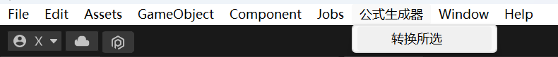

# Express Generator 公式生成器
使用Excel编辑公式，然后生成单独的C#类

原理为通过文本替换实现
## Excel表格范例
以本项目中`Assets/Excel/DMGCalculate.xlsx`为例：


- 第一行定义了4个属性：`VariableName 变量名`、`AtlasName 别名`、`Desc 注释`、`Function 表达式` 它们的名字可以随意更改，因为表格的第一行在转换过程中会被忽略，仅作为表格编辑人员参考。
- `VariableName 变量名`和`AtlasName 别名`必须是唯一的，不能有重复。`VariableName 变量名`为英文，`AtlasName 别名`可以是中文，别名的作用是在表达式中可以使用别名代替英文变量名
- Excel表格中可以有多个工作表(Sheet)，范例中细分为了4个Sheet，不同Sheet之间的变量可以互相被识别
- Function处留空的变量被认为是外部输入，程序必须输入这些值，其他值才能被计算


`伤害计算`的Sheet中定义了几个最终输出的公式
- 因为本公式生成器本质上是文本替换组合，因此Function中可以使用一些程序中的方法，比如`UnityEngine.Random()`，它代表取一个范围闭区间的随机数；`a?b:c`三元表达式，如果a成立，则取b，a不成立，则取c。


## 输出范例
根据本项目中示例的Excel表格，生成的C#文件内容如下：


## 导入到项目中并使用
1. 复制 `Assets/Script/ExpressionGen`到你的Unity项目任意目录下
   > 如果你没有安装ExcelReader，则还额外需要复制`Assets/Plugins`到你的项目下
2. 在Unity Project标签页中选中一个符合规范的Excel表格，本项目的`Assets/Excel`中包含有示例
3. 在菜单栏中选择`公式生成器/转换所选`，输出的C# Class在 `Assets/ExprGen`下
   
   
4. 你可以修改输出位置，或将该.cs文件放入热更新中
5. 代码中调用(以本项目的`DMGCaculate`为例)：
   ``` csharp
    DMGCalculate calculate = new DMGCalculate(100, 20, 50, ...) ; //填写所有参数
    Debug.Log("最终结算的伤害是: "+ calculate.FinalDamage);
   ```

## Bug
由于公式生成本质上只是文本替换，因此对于多个互相包含关键字的别名和变量名会造成冲突，比如在Excel中定义：
|变量名|别名|注释|公式|
|---|---|---|---|
|atk|攻击力|玩家的攻击力|
|enemyAtk|敌人攻击力|敌人的攻击力|
|enemyDef|敌人防御力|敌人的防御力|
|finalDMG|最终伤害|最终计算的伤害|攻击力-敌人防御力-敌人攻击力*0.1f|

由于`敌人攻击力`中包含有另一个别名`攻击力`，因此在转换过程中，`敌人攻击力`会被错误的转换为`敌人atk`，最终导致转换结果不可用

### 避免发生这种事情
尽量避免取太过于简短且涵义较广的名字。在上述例子中，`攻击力`可以修改成`玩家攻击力`，这样`玩家攻击力`与`敌人攻击力`不成被包含关系，可以正常转换。


## TODO
- 转换所选的多个Excel文件
- 支持函数简写
- 数值类型定义
- 访问级别修饰符定义